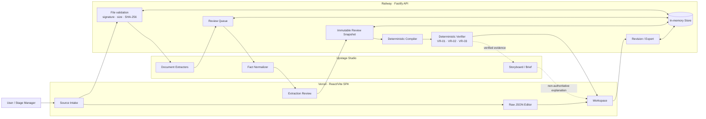

# STANDBY

> **Pre-flight verification for live stage productions.**
> 대본, 마스터 큐시트, 무대 사양 사이의 괴리를 리허설 전에 찾아내고 근거와 2D 무대 상태로 재현합니다.

[Live Demo](https://standby-junctionx.vercel.app/) · [API Health](https://standby-api-production.up.railway.app/healthz) · [Current Feature Spec](project/FEATURE_SPEC_CURRENT.md) · [Upstage Usage](project/UPSTAGE_USAGE_SPEC.md)

STANDBY는 공연 문서를 단순히 요약하는 도구가 아닙니다. Upstage Studio Agent로 비정형 문서를
근거가 붙은 fact 후보로 구조화하고, 사람이 승인한 사실만 결정론적 compiler/verifier에 전달해
환복 시간, 동선 수용량, 소품 연속성 문제를 검증합니다. 결과는 큐시트, 대본, 이벤트 타임라인과
동기화된 2D 무대에서 확인할 수 있습니다.


## Why STANDBY

공연 제작 정보는 하나의 데이터베이스가 아니라 여러 문서와 사람에게 흩어져 있습니다.

- 대본에는 대사, 지문, 등장·퇴장과 장면 전환이 섞여 있습니다.
- 마스터 큐시트에는 조명, 음향, 무대, 소품, 의상, 영상 큐가 서로 다른 표현으로 기록됩니다.
- 무대 사양에는 윙, 백스테이지 통로, 이동 시간, 수용 인원과 초기 배치가 있습니다.
- 대본이나 큐 하나가 바뀌면 이후 환복, 동선, 소품 상태가 연쇄적으로 영향을 받습니다.

기존 방식은 여러 부서가 문서를 한 줄씩 대조하거나 실제 무대 리허설에서 오류를 발견합니다.
STANDBY는 이 대조 작업을 공연 전에 실행 가능한 검증 흐름으로 바꿉니다.

## Try it without a cue sheet

심사위원이나 첫 사용자가 별도의 공연 파일을 준비할 필요는 없습니다.

1. [Live Demo](https://standby-junctionx.vercel.app/)를 엽니다.
2. `MASTER CUE` 카드의 **Attach example cue sheet / 예시 큐시트 첨부**를 선택합니다.
3. 필요하면 Stage Spec을 입력하고 **Start Upstage extraction**을 누릅니다.
4. 추출된 원문 근거를 확인하고 일괄 승인하거나 항목별로 검토합니다.
5. Workspace에서 이벤트, 큐시트, 대본, 2D 무대 상태와 finding을 함께 확인합니다.

예시 파일도 일반 업로드와 동일한 파일 검사, SHA-256, Upstage API 경로를 사용합니다.
특정 파일 hash에 따른 데모 우회는 없으며, origin만 `CONTROLLED_FIXTURE`로 표시해 실제 공연 문서와 구분합니다.

## Core capabilities

| 영역 | 현재 동작 |
|---|---|
| Master Cue intake | XLSX, PDF, JSON 및 다중 파일 선택을 지원합니다. 제품 내 예시 JSON도 실제 파일처럼 첨부할 수 있습니다. |
| Raw JSON editor | STANDBY canonical JSON은 Upstage 재추출 없이 즉시 로컬 Editor와 결정론적 validator로 엽니다. |
| Stage Spec | crossover, 환복 최소 시간, route/capacity, 이동 시간, 인물·소품 초기 배치를 구조화해 입력합니다. |
| Upstage extraction | cue row, 부서, 트리거, 인물, 동작, 위치, 소품, 의상을 locator와 source quote가 있는 `UNREVIEWED` fact로 만듭니다. |
| Extraction Review | 원문 필드와 추천을 검토하고 승인·거절·수정합니다. Agent 추천은 승인 전까지 판정에 쓰이지 않습니다. |
| Deterministic verification | VR-01 quick-change, VR-02 route capacity, VR-03 prop continuity를 코드로 계산합니다. |
| Evidence Trace | 모든 finding에 SCRIPT, MASTER_CUE, STAGE_SPEC 근거와 계산을 연결합니다. |
| 2D stage simulator | 이벤트별 인물·소품 상태와 인접 이벤트의 `ENTER`/`EXIT` 의미 전환을 표시합니다. 시뮬레이터는 읽기 전용입니다. |
| Script Sidebar | DOCX 우선, PDF 보조 대본을 읽고 실제 대사·지문을 timeline event와 연결합니다. |
| Cue revision | 셀 편집, 이벤트 추가·삭제, 미저장 상태, append-only revision history와 복원을 지원합니다. |
| Export | 원본 레이아웃을 보존한 새 XLSX, 표준 DOCX, 브라우저 PDF 인쇄본, UTF-8 CSV를 제공합니다. |
| International demo | 한국어와 영어 UI를 전환하며 선택한 언어를 브라우저에 보존합니다. |

구현 여부와 남은 제한은 [현재 기능 명세](project/FEATURE_SPEC_CURRENT.md)가 정본입니다.

## How Upstage is used

Upstage는 **문서 이해와 비권위적 추천·설명**을 담당합니다. 실제 안전 관련 verdict는 Upstage가 아니라
사람이 승인한 fact를 읽는 STANDBY의 결정론적 코드가 만듭니다.

```text
공연 문서
  → Upstage: 읽기 · 추출 · 구조화 · 추천
  → 사람: 승인 · 거절 · 수정 · 연결
  → STANDBY: 상태 전이 · 충돌 계산 · verdict
  → Upstage: 이미 계산된 결과의 storyboard · rehearsal brief
```

| Upstage Studio Agent | 입력 | 출력과 제품 내 역할 | Authority |
|---|---|---|---|
| Script Extractor | DOCX/PDF 대본 | 대사, 지문, 화자, 장면, locator → Script Sidebar | `UNREVIEWED` |
| Master Cue Extractor | XLSX/PDF/JSON | cue row별 트리거, 인물, 동작, 소품, 의상, 근거 | `UNREVIEWED` |
| Stage Spec Extractor | 구조화된 무대 사양 | route, capacity, 초기 배치 fact 후보 | `UNREVIEWED` |
| Fact Normalizer | raw fact + 허용 schema | 표준 fact type/value 추천 | `NON_AUTHORITATIVE` |
| Storyboard Recomposer | reviewed event + 인접 snapshot | action beat와 누락 근거 설명 | `NON_AUTHORITATIVE` |
| Rehearsal Brief | deterministic finding + evidence | 부서별 확인 질문과 리허설 요약 | `NON_AUTHORITATIVE` |

복잡한 병합 셀, 한국어 공연 용어, 대사와 지문, 부서별 표현은 일반 표 파서만으로 의미를 분리하기 어렵습니다.
Upstage가 이 비정형 구간의 coverage를 담당하고, STANDBY는 strict decoder, schema allowlist,
source locator, human review로 결과를 통제합니다. 상세 계약과 live-smoke 범위는
[Upstage 활용 명세](project/UPSTAGE_USAGE_SPEC.md)를 참고하세요.

## Trust model

STANDBY의 세 가지 제품 원칙은 다음과 같습니다.

| 원칙 | 구현 경계 |
|---|---|
| **Verifier first** | LLM은 verdict를 생성하거나 변경하지 않습니다. compiler/verifier는 네트워크 호출이 없는 결정론적 모듈입니다. |
| **Evidence always** | finding은 역할별 source locator, quote, review state와 계산을 함께 제공합니다. |
| **Human decides** | Upstage 결과는 항상 후보이며, 사람의 review snapshot에 승인된 fact만 authority를 얻습니다. |

검증 결과는 `VIOLATION`, `REVIEW`, `INSUFFICIENT_EVIDENCE` 세 가지입니다.
정보가 부족하면 임의로 안전하다고 결론 내리지 않고, 무엇이 없어 판단할 수 없는지 표시합니다.

## End-to-end flow



현재 공개 MVP는 상태와 원문을 Railway 프로세스 메모리에 보관합니다. PostgreSQL/Supabase 영속화와
OAuth 계정 복구는 운영 제품 전환 범위이며 현재 구현으로 주장하지 않습니다.

## Technology stack

| Layer | Technology |
|---|---|
| Frontend | React 19, TypeScript, Vite, Tailwind CSS v4, TanStack Router, Zustand |
| Backend | Node.js 22+, TypeScript, Fastify |
| AI document workflow | Upstage Studio Agents, Upstage Files/Responses API |
| Contracts | JSON Schema, strict TypeScript decoders, SHA-256 provenance |
| Verification | Deterministic compiler, state machine, VR-01/02/03 rules |
| Deployment | Vercel SPA, Railway Docker deployment |
| Testing | Node test runner, controlled fixtures, typecheck and production builds |

## Repository map

```text
app/                         React/Vite frontend
  src/screens/               intake, review, workspace screens
  src/components/domain/     cue editor, script sidebar, stage simulator
  src/lib/                   API client, JSON/CSV adapters, i18n
server/                      Fastify API and Upstage orchestration
  src/providers/             Upstage and extraction providers
  src/domain/                compiler, verifier, revisions, exports
  src/store/                 current in-memory ownership/state store
  test/                      contract, auth, extraction, verifier, export tests
contracts/                   app/API/worker JSON Schema contracts
project/                     PRD, feature, architecture and Upstage specifications
Lo-Fi/standby/DESIGN.md      UI behavior and visual invariants
qa/                          sanitized screenshots and live-smoke evidence
```

## Local development

### Prerequisites

- Node.js 22.12 or later
- npm
- Upstage API key for live DOCX/PDF/XLSX extraction

The canonical Raw JSON editor can run without Upstage. Master Cue and Script document extraction require the backend
and a server-side `UPSTAGE_API_KEY`.

### 1. Start the API

```bash
cd server
npm ci
cp .env.example .env
# Set UPSTAGE_API_KEY in server/.env
npm run dev
```

The API starts at `http://localhost:8787`.

### 2. Start the frontend

In a second terminal:

```bash
cd app
npm ci
cp .env.example .env
npm run dev
```

Open `http://localhost:5173`.

### Environment boundary

| Variable | Location | Purpose |
|---|---|---|
| `VITE_STANDBY_API_BASE_URL` | `app/.env` / Vercel | Public backend base URL only |
| `UPSTAGE_API_KEY` | `server/.env` / Railway | Upstage credential; never exposed to the browser |
| `UPSTAGE_AGENT_ID_*`, `UPSTAGE_CONFIG_ID_*` | server | Role-specific Agent and Config selection |
| `STANDBY_ALLOWED_ORIGINS` | server | CORS allowlist |
| `STANDBY_ALLOW_ANONYMOUS` | server | Enables the public hackathon session flow |
| `STANDBY_API_TOKEN` | local/test server only | Static bearer token when anonymous mode is disabled |

Never put `UPSTAGE_API_KEY`, `STANDBY_API_TOKEN`, database secrets, or private source documents in Vercel variables
that are bundled into the SPA.

## Verification

Run the frontend checks:

```bash
cd app
npm ci
npm run typecheck
npm run build
```

Run the backend checks:

```bash
cd server
npm ci
npm run typecheck
npm test
npm run build
```

The controlled verifier fixtures cover:

- unreviewed facts → all rules abstain with `INSUFFICIENT_EVIDENCE`
- reviewed hero case → 8-event graph and VR-01/02/03 findings
- tight quick-change → `REVIEW`
- clean control → zero findings
- cross-session case access → `404`
- XLSX revision/export round trip and script projection contracts

Fixtures demonstrate deterministic behavior and integration contracts; they are not proof that an arbitrary real
production is safe or that extraction accuracy is perfect.

## API overview

The browser sends a UUID v4 in `X-STANDBY-SESSION`. State-changing requests also use `Idempotency-Key`.

| Flow | Endpoint |
|---|---|
| Health | `GET /healthz` |
| Create case | `POST /v1/cases` |
| Add source | `POST /v1/cases/:caseId/sources/:role` |
| Extract | `POST /v1/cases/:caseId/extraction-runs` |
| Poll operation | `GET /v1/operations/:operationId` |
| Review queue | `GET /v1/cases/:caseId/review-queue` |
| Batch review | `POST /v1/cases/:caseId/fact-reviews:batch` |
| Freeze and verify | `POST /v1/cases/:caseId/review-snapshots` |
| Workspace | `GET /v1/cases/:caseId/workspace` |
| Cue revision | `POST /v1/cases/:caseId/cue-revisions` |
| Export | `GET /v1/cases/:caseId/cue-revisions/:revisionId/export.xlsx` |

See [server/README.md](server/README.md) for the complete runtime and security contract.

## Security and current limitations

Implemented safeguards:

- Upstage credentials remain server-side.
- CORS allowlist, Helmet and request rate limits are enabled.
- JSON bodies are limited to 1 MiB and source files to 50 MiB.
- Role-specific extension, MIME and file-signature validation runs before extraction.
- Browser session IDs are hashed and every case/operation is owner-checked.
- A different session receives `404` instead of resource-existence information.
- Agent outputs pass strict decoders and provenance checks before entering review.

Known MVP limitations:

- Anonymous UUID sessions are not login or user identity.
- Case, review and uploaded-source state is in memory and is lost on API restart.
- Object storage, malware scanning, audit retention and account recovery are not implemented.
- Real Korean production documents still need a larger gold-set fidelity evaluation.
- The latest full multi-Agent live-smoke run must be repeated after resolving the recorded Upstage `/v2` HTTP 403.

## Deployment

- Frontend: Vercel builds `app/` using the root [vercel.json](vercel.json).
- Backend: Railway builds [server/Dockerfile](server/Dockerfile) and checks `/healthz` using [railway.json](railway.json).
- Production frontend only receives `VITE_STANDBY_API_BASE_URL`; all secrets remain on Railway.

```bash
# Reproduce the backend image from the repository root
docker build -f server/Dockerfile -t standby-server .
```

## Documentation

| Document | Purpose |
|---|---|
| [PRD](project/PRD_CLAUDE.md) | Product boundary, rules and acceptance criteria |
| [Current Feature Spec](project/FEATURE_SPEC_CURRENT.md) | As-is implementation and remaining work |
| [Upstage Usage Spec](project/UPSTAGE_USAGE_SPEC.md) | Agent roles, authority boundary and demo narrative |
| [Backend Architecture](project/BACKEND_ARCHITECTURE.md) | Current MVP and target production architecture |
| [JSON Contracts](contracts/README.md) | Shared schemas and normalized review envelope |
| [UI Contract](Lo-Fi/standby/DESIGN.md) | Layout, motion and interaction invariants |
| [Domain Research](project/DOMAIN.md) | Stage-production workflow and problem framing |
| [Contributing](CONTRIBUTING.md) | Branch, commit, privacy and collaboration rules |

## Contribution rules

- Do not commit original scripts, cue sheets, applications, portfolios, API keys or `.env` files.
- Do not push directly to `main`; use a short-lived branch and a focused PR.
- Stage explicit paths instead of `git add .`.
- Keep one commit focused on one verifiable behavior.
- Run the relevant app/server typecheck, tests and production build before handoff.

---

Built for **JunctionX Korea 2026 · Upstage Track**.
