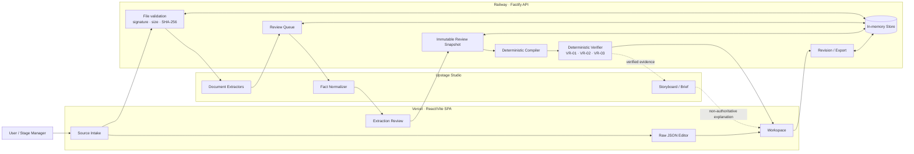

# 🎭 STANDBY — 공연 프리플라이트 검증기 (Stage Pre-flight Verifier)

> **"공연계에는 리허설이라는 런타임 테스트만 있고, 정적 분석기(컴파일러)가 없다."**  
> 대본 · 마스터 큐시트 · 무대 사양을 한 공연 순서로 대조하여 시간 · 동선 · 소품 · 환복 모순을 **리허설 전에** 찾아내고, 원문 근거와 함께 2D 무대 위에서 재현하는 공연 프리플라이트 검증 시스템입니다.

[](https://standby-junctionx.vercel.app/)
[](https://standby-api-production.up.railway.app/healthz)
[](https://github.com/Rudy-009/45_Junction_Project)
[](project/UPSTAGE_USAGE_SPEC.md)
[](https://react.dev)
[](https://fastify.dev)

---

## ⚡ 30초 라이브 데모 가이드 (Try It Instantly)

심사위원이나 첫 방문자가 별도의 공연 문서를 준비하지 않아도 즉시 전체 E2E 검증을 체험할 수 있습니다:

1. **[Live Demo](https://standby-junctionx.vercel.app/)**에 접속합니다.
2. `MASTER CUE` 카드의 **Attach example cue sheet (예시 큐시트 첨부)** 버튼을 누릅니다.
3. **Start Upstage extraction**을 눌러 비정형 큐시트에서 추출된 Fact 후보를 확인합니다.
4. **Extraction Review** 화면에서 팩트를 확인하고 승인(Approve)합니다.
5. **Workspace**로 이동하여 타임라인 `E3` (🔴 `VIOLATION: 환복시간 58s vs 66s`)를 클릭합니다.
6. **'이 위치로 이동'** $\to$ 큐시트 `58s`를 **`70s`**로 수정 후 **저장** $\to$ **🟢 `CONSISTENT`로 실시간 반전**되는 쾌감을 확인하세요!

---


---

## 💡 Why STANDBY (문제 정의와 포지셔닝)

### 1. 현장의 문제: 분열된 진실과 인간 암산의 한계
* 공연 현장에는 무대감독의 **프롬프트북**, 부서별 큐를 모은 **마스터 큐시트**, 소품팀의 **프리셋 리스트** 등 최소 5종의 문서가 병존합니다.
* 이들은 *동일한 사실을 다르게 적은 사본*이지만, 문서 간 불일치를 사전에 자동으로 교차 검증해 주는 장치가 없었습니다.
* 특히 암전(전환 구간) 시 40초 동안 수많은 부서와 배우, 소품이 동시에 움직일 때, 인간의 암산 한계로 인해 **리허설 무대 위에서 사고(환복 불가, 소품 미배치 등)**가 터집니다.

### 2. 우리의 포지셔닝: 저작 도구가 아닌 "린터(Linter)"
* 기존 상용 SaaS(Stage Write, Propared 등)는 **"기존 엑셀을 버리고 우리 툴로 이주하라"**고 요구합니다.
* 하지만 현장(소극장, 대학 극단, K-pop 콘서트팀)은 유연하고 익숙한 **엑셀**을 결코 버릴 수 없습니다.
* **STANDBY는 엑셀을 버리게 하지 않고, 기존 엑셀을 그대로 먹고 검증한 뒤 원본 서식 그대로 돌려줍니다.**

---

## ⚖️ 3대 제품 불변 원칙 & 신뢰 모델 (Trust Model)

STANDBY는 LLM이 마음대로 안전 결론을 환각(Hallucination)하지 못하도록 엄격한 원칙을 둡니다.

| 원칙 | 구현 경계와 의미 |
|---|---|
| **1. Verifier first** | **판정은 결정론적 코드(수학적 규칙)**가 내립니다. LLM은 결코 판정(`verdict`)을 조작할 수 없습니다. |
| **2. Evidence always** | 모든 Finding은 반드시 **`SCRIPT`(대본), `CUESHEET`(큐시트), `STAGE_SPEC`(무대사양)** 3대 출처의 인용문과 위치 근거를 갖습니다. |
| **3. Human decides** | AI는 Fact 후보와 제안 문구만 제공하며, 최종 승인과 수정 결정은 **인간 무대감독**이 내립니다. |

### 🎯 3대 판정 체계 (Verdict)
* **🔴 `VIOLATION` (위반):** 명시된 시간·경로·상태가 물리적·수학적으로 양립 불가능함. (예: 가용 시간 58s < 필요 시간 66s)
* **🟡 `REVIEW` (검토):** 시간 범위가 겹치거나, 소품 이동 담당 크루가 누락된 경우.
* **⬜ `INSUFFICIENT_EVIDENCE` (근거 부족):** **STANDBY의 핵심 정체성**. 판정에 필요한 수치가 문서에 없을 때 억지로 추정하지 않고 *"이 정보가 없어서 판정하지 못함"*을 명시적 기권(Abstention).

---

## 📐 결정론적 검증 규칙 (Deterministic Rules)

* **VR-01. Quick-change Feasibility (환복 가능성):**
  $$\text{Required} = \text{Route}(\text{퇴장}\to\text{환복소}) + \text{Min Change Time} + \text{Route}(\text{환복소}\to\text{입장})$$
  $$\text{Available} = \text{다음 입장 시각} - \text{이전 퇴장 시각}$$
  $\text{Available} < \text{Required}$이면 즉시 `VIOLATION`.
* **VR-02. Blocking / Route Conflict (동선/통로 충돌):**
  백스테이지 통로(`crossover`)가 없는데 반대편 윙으로 재등장해야 하거나 통로 수용 인원을 초과하면 `VIOLATION`.
* **VR-03. Prop Continuity (소품 연속성):**
  초기 배치(`initial_state`)에서 시작해 소품의 인계자나 이동 경로가 누락되면 `REVIEW`.

---

## 🤖 Upstage Document AI 파이프라인 (How Upstage is Used)

Upstage는 **비정형 공연 문서의 이해와 비권위적(Non-authoritative) 추천·설명**을 담당합니다. 실제 물리적 안전 판정은 Upstage가 아니라 사람이 승인한 Fact를 읽는 STANDBY의 결정론적 Verifier가 수행합니다.

```text
공연 원문 문서 (PDF / DOCX / XLSX / JSON)
  ↓
Upstage Studio Agents: 읽기 · 다중 열 분리 · Fact 추출 · 구조화
  ↓
인간 무대감독: Fact Review (승인 · 거절 · 값 수정)
  ↓
STANDBY Deterministic Engine: 상태 전이 추적 · 물리적 충돌 계산 · Verdict 판정
  ↓
Upstage Storyboard & Brief: 계산된 근거 기반의 Rehearsal Brief & 비권위적 설명 생성
```

| Upstage Studio Agent | 입력 | 제품 내 역할 | Authority |
|---|---|---|---|
| **Script Extractor** | DOCX/PDF 대본 | 대사, 지문, 화자, 장면, locator $\to$ Script Sidebar 연결 | `UNREVIEWED` |
| **Master Cue Extractor** | XLSX/PDF/JSON | 17열 큐시트의 트리거, 인물, 동작, 소품, 의상, 근거 추출 | `UNREVIEWED` |
| **Stage Spec Extractor** | 구조화 무대사양 | route, capacity, 초기 배치 fact 후보 추출 | `UNREVIEWED` |
| **Fact Normalizer** | raw fact + schema | 표준 fact type/value 추천 (읽기 전용 보조) | `NON_AUTHORITATIVE` |
| **Storyboard Recomposer**| reviewed event | 2D 무대 액션 비트 및 결측 근거 해설 | `NON_AUTHORITATIVE` |
| **Rehearsal Brief** | deterministic finding | 부서별 체크리스트 및 리허설 브리핑 요약 | `NON_AUTHORITATIVE` |

---

## 🔄 End-to-End 시스템 아키텍처 (Architecture Flow)



현재 공개 MVP는 상태와 원문을 Railway 프로세스 메모리에 보관합니다. PostgreSQL/Supabase 영속화와
OAuth 계정 복구는 운영 제품 전환 범위이며 현재 구현으로 주장하지 않습니다.

## Technology stack

| Layer | Technology |
|---|---|
| Frontend | React 19, TypeScript, Vite, Tailwind CSS v4, TanStack Router, Zustand |
| Backend | Node.js 22+, TypeScript, Fastify |
| AI document workflow | Upstage Studio Agents, Upstage Files/Responses API |
| Contracts | JSON Schema, strict TypeScript decoders, SHA-256 provenance |
| Verification | Deterministic compiler, state machine, VR-01/02/03 rules |
| Deployment | Vercel SPA, Railway Docker deployment |
| Testing | Node test runner, controlled fixtures, typecheck and production builds |

## Repository map

```text
app/                         React/Vite frontend
  src/screens/               intake, review, workspace screens
  src/components/domain/     cue editor, script sidebar, stage simulator
  src/lib/                   API client, JSON/CSV adapters, i18n
server/                      Fastify API and Upstage orchestration
  src/providers/             Upstage and extraction providers
  src/domain/                compiler, verifier, revisions, exports
  src/store/                 current in-memory ownership/state store
  test/                      contract, auth, extraction, verifier, export tests
contracts/                   app/API/worker JSON Schema contracts
project/                     PRD, feature, architecture and Upstage specifications
Lo-Fi/standby/DESIGN.md      UI behavior and visual invariants
qa/                          sanitized screenshots and live-smoke evidence
```

## Local development

### Prerequisites

- Node.js 22.12 or later
- npm
- Upstage API key for live DOCX/PDF/XLSX extraction

The canonical Raw JSON editor can run without Upstage. Master Cue and Script document extraction require the backend
and a server-side `UPSTAGE_API_KEY`.

### 1. Start the API

```bash
cd server
npm ci
cp .env.example .env
# Set UPSTAGE_API_KEY in server/.env
npm run dev
```

The API starts at `http://localhost:8787`.

### 2. Start the frontend

In a second terminal:

```bash
cd app
npm ci
cp .env.example .env
npm run dev
```

Open `http://localhost:5173`.

### Environment boundary

| Variable | Location | Purpose |
|---|---|---|
| `VITE_STANDBY_API_BASE_URL` | `app/.env` / Vercel | Public backend base URL only |
| `UPSTAGE_API_KEY` | `server/.env` / Railway | Upstage credential; never exposed to the browser |
| `UPSTAGE_AGENT_ID_*`, `UPSTAGE_CONFIG_ID_*` | server | Role-specific Agent and Config selection |
| `STANDBY_ALLOWED_ORIGINS` | server | CORS allowlist |
| `STANDBY_ALLOW_ANONYMOUS` | server | Enables the public hackathon session flow |
| `STANDBY_API_TOKEN` | local/test server only | Static bearer token when anonymous mode is disabled |

Never put `UPSTAGE_API_KEY`, `STANDBY_API_TOKEN`, database secrets, or private source documents in Vercel variables
that are bundled into the SPA.

## Verification

Run the frontend checks:

```bash
cd app
npm ci
npm run typecheck
npm run build
```

Run the backend checks:

```bash
cd server
npm ci
npm run typecheck
npm test
npm run build
```

The controlled verifier fixtures cover:

- unreviewed facts → all rules abstain with `INSUFFICIENT_EVIDENCE`
- reviewed hero case → 8-event graph and VR-01/02/03 findings
- tight quick-change → `REVIEW`
- clean control → zero findings
- cross-session case access → `404`
- XLSX revision/export round trip and script projection contracts

Fixtures demonstrate deterministic behavior and integration contracts; they are not proof that an arbitrary real
production is safe or that extraction accuracy is perfect.

## API overview

The browser sends a UUID v4 in `X-STANDBY-SESSION`. State-changing requests also use `Idempotency-Key`.

| Flow | Endpoint |
|---|---|
| Health | `GET /healthz` |
| Create case | `POST /v1/cases` |
| Add source | `POST /v1/cases/:caseId/sources/:role` |
| Extract | `POST /v1/cases/:caseId/extraction-runs` |
| Poll operation | `GET /v1/operations/:operationId` |
| Review queue | `GET /v1/cases/:caseId/review-queue` |
| Batch review | `POST /v1/cases/:caseId/fact-reviews:batch` |
| Freeze and verify | `POST /v1/cases/:caseId/review-snapshots` |
| Workspace | `GET /v1/cases/:caseId/workspace` |
| Cue revision | `POST /v1/cases/:caseId/cue-revisions` |
| Export | `GET /v1/cases/:caseId/cue-revisions/:revisionId/export.xlsx` |

See [server/README.md](server/README.md) for the complete runtime and security contract.

## Security and current limitations

Implemented safeguards:

- Upstage credentials remain server-side.
- CORS allowlist, Helmet and request rate limits are enabled.
- JSON bodies are limited to 1 MiB and source files to 50 MiB.
- Role-specific extension, MIME and file-signature validation runs before extraction.
- Browser session IDs are hashed and every case/operation is owner-checked.
- A different session receives `404` instead of resource-existence information.
- Agent outputs pass strict decoders and provenance checks before entering review.

Known MVP limitations:

- Anonymous UUID sessions are not login or user identity.
- Case, review and uploaded-source state is in memory and is lost on API restart.
- Object storage, malware scanning, audit retention and account recovery are not implemented.
- Real Korean production documents still need a larger gold-set fidelity evaluation.
- The latest full multi-Agent live-smoke run must be repeated after resolving the recorded Upstage `/v2` HTTP 403.

## Deployment

- Frontend: Vercel builds `app/` using the root [vercel.json](vercel.json).
- Backend: Railway builds [server/Dockerfile](server/Dockerfile) and checks `/healthz` using [railway.json](railway.json).
- Production frontend only receives `VITE_STANDBY_API_BASE_URL`; all secrets remain on Railway.

```bash
# Reproduce the backend image from the repository root
docker build -f server/Dockerfile -t standby-server .
```

## Documentation

| Document | Purpose |
|---|---|
| [PRD](project/PRD_CLAUDE.md) | Product boundary, rules and acceptance criteria |
| [Current Feature Spec](project/FEATURE_SPEC_CURRENT.md) | As-is implementation and remaining work |
| [Upstage Usage Spec](project/UPSTAGE_USAGE_SPEC.md) | Agent roles, authority boundary and demo narrative |
| [Backend Architecture](project/BACKEND_ARCHITECTURE.md) | Current MVP and target production architecture |
| [JSON Contracts](contracts/README.md) | Shared schemas and normalized review envelope |
| [UI Contract](Lo-Fi/standby/DESIGN.md) | Layout, motion and interaction invariants |
| [Domain Research](project/DOMAIN.md) | Stage-production workflow and problem framing |
| [Contributing](CONTRIBUTING.md) | Branch, commit, privacy and collaboration rules |

## Contribution rules

- Do not commit original scripts, cue sheets, applications, portfolios, API keys or `.env` files.
- Do not push directly to `main`; use a short-lived branch and a focused PR.
- Stage explicit paths instead of `git add .`.
- Keep one commit focused on one verifiable behavior.
- Run the relevant app/server typecheck, tests and production build before handoff.

---

Built for **JunctionX Korea 2026 · Upstage Track**.
